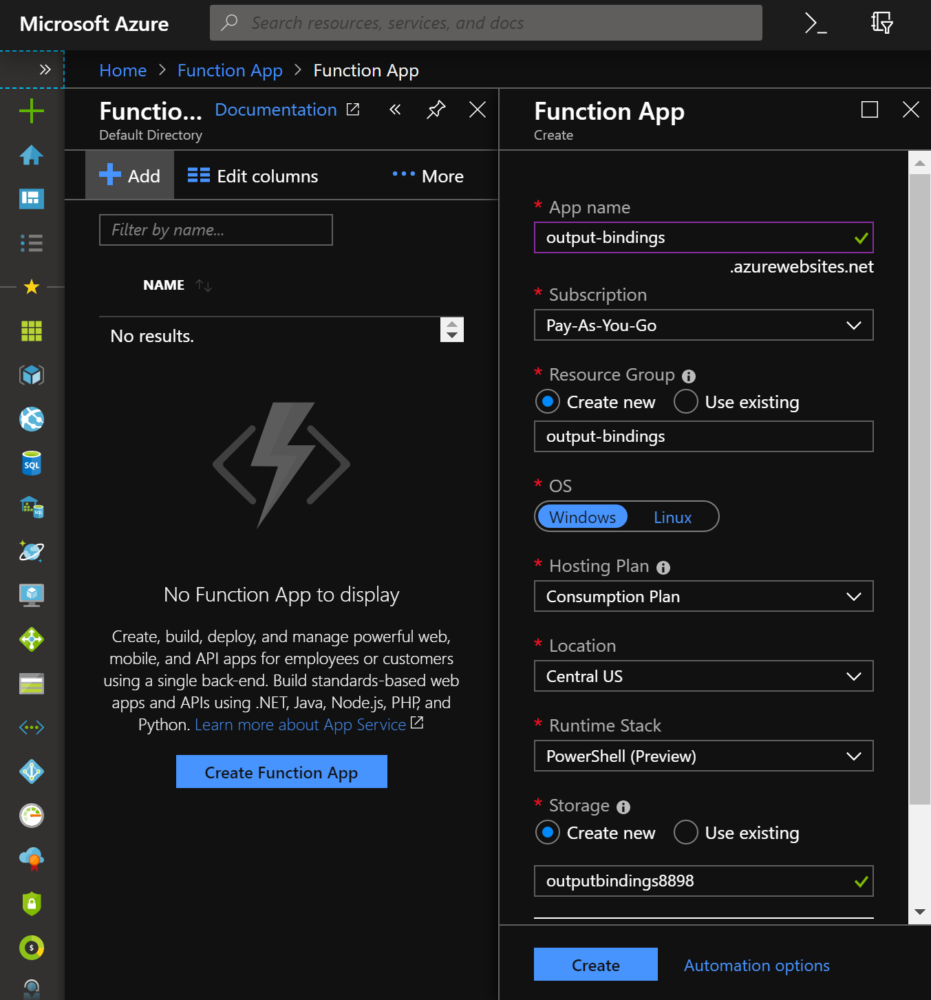
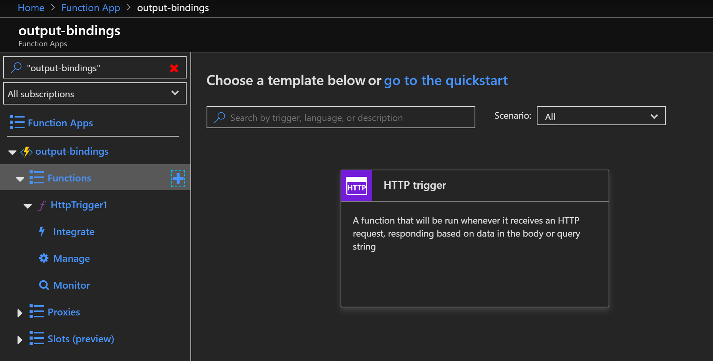
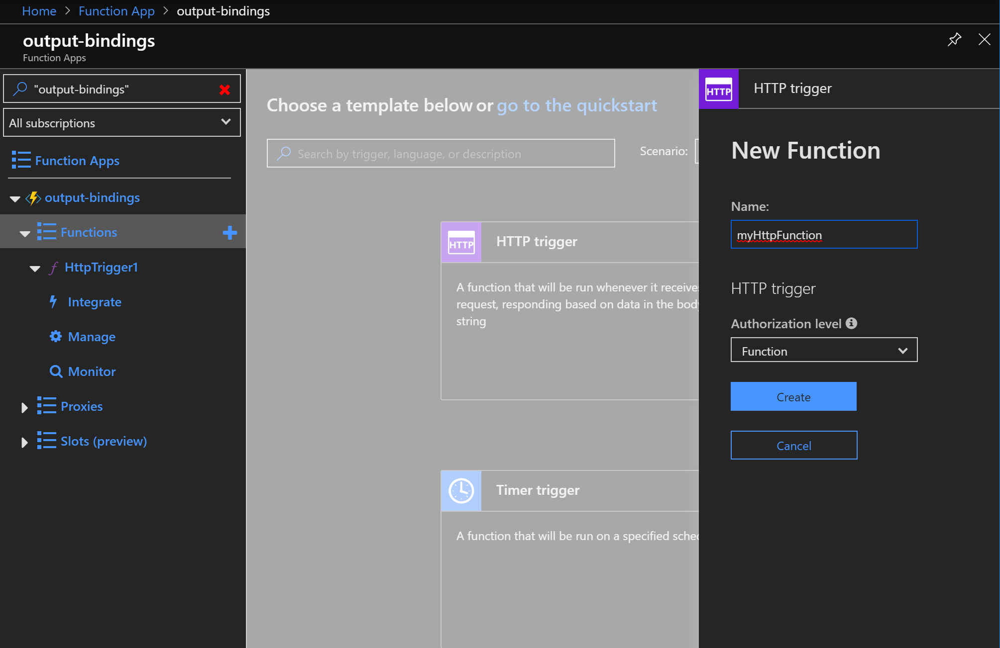
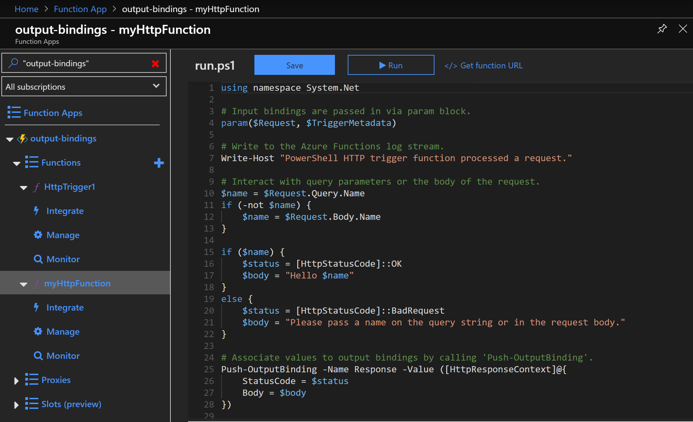
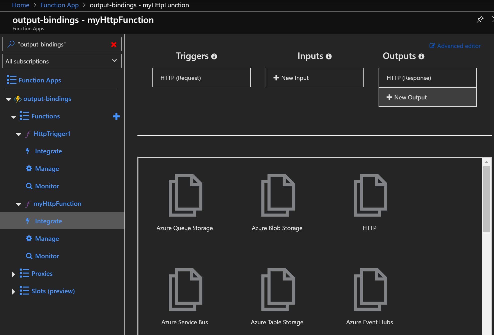
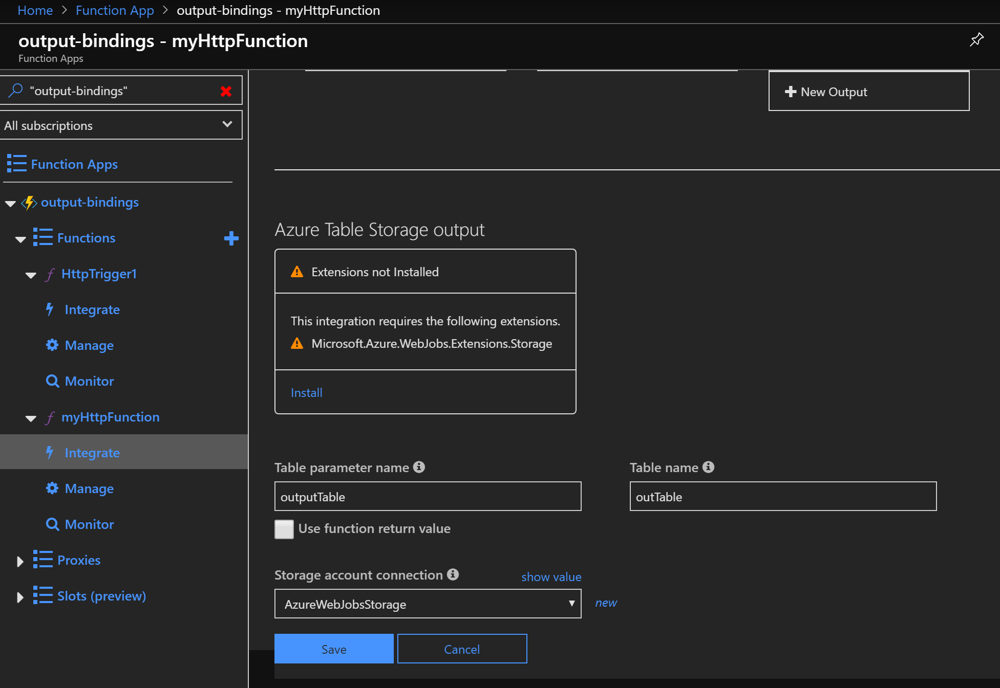

### Write to Azure Table Storage using Azure Functions' Output Bindings and Powershell

Table Storage is a cheap storage solution on Azure that can be used any time you need to store tabular data, but don't want the cost or complexity of an actual database.

Azure Functions' Output Bindings allow you to write an object or list of objcts to table storage for analysis, long term storage etc. Since the Powershell runtime stack for Azure Functions is still in preview, there isn't much documentation around on how to configure it.

I personally wanted to get Pipeline Run information out of Data Factory v2 and store it in Table Storage, which works well using this technique.

## Create a new Azure Function App for Powershell

Add a new Function App, specifying the "Powershell (Preview)" Runtime Stack:


## Create a function
There are a few steps to create a new function, here's the abridged version.

Push the "+" button next to the "Functions" section of your new Function App, and then select "HTTP Trigger" as the trigger type:


Choose a name for the function:


The sample code should now appear:


## Add the output binding

From the Function App screen, select "Integrate". This will display the screen where Output Bindings are configured. Select "New Output" and then "Azure Table Storage", then click the "Select" button.


The Azure Table Storage output configuration should now appear. If you haven't installed the Microsoft.Azure.WebJobs.Extensions.Storage extension, click Install, then wait the two minutes or so that it takes to install (it looks like you can continue at this point, but I would recommend waiting for the install to complete before leaving the screen).

Most of the other settings can stay as they are, unless you want to create the Table Storage table in a specific account, in which case follow the steps to change the storage account:


## Write some code

Create an array (this array will be sent to Table Storage):
```powershell
$outputArray = @()
```

Using a dictionary to represent each row, add some records to the output array. Each row should include the indexes "RowKey" and "PartitionKey". The Partition Key represents the partition in Table Storage where the row will be stored. The RowKey must be a unique value identifying each row within a partition:
```powershell
while($val -ne 10)
     {
       $outputRow = @{}
       
       $outputRow["PartitionKey"] = "MyPartition"
       
       ##This value must be unique within each partition. If it is not, the existing row will be overwritten!
       $outputRow["RowKey"] = $val
       
       ##Add the row to the output array
       $outputArray += $outputRow
       
       $val++
     }
```

Associate your array with the output binding. The value of the parameter at **-Name** must match the **Table parameter name** from the **Add the output binding** section above:
```powershell
Push-OutputBinding -Name outTable -Value $outputArray
```
## More reading
* [Microsoft's documentation](https://docs.microsoft.com/en-us/azure/azure-functions/functions-bindings-storage-table) on Azure Functions and Output Bindings (useful for all other runtime languages)
* [Another blog post](https://blog.kloud.com.au/2019/04/17/leveraging-the-azure-functions-table-storage-output-binding-with-powershell/) on the same subject, although this technique is somewhat more complicated, and I couldn't get it to work as written. 
